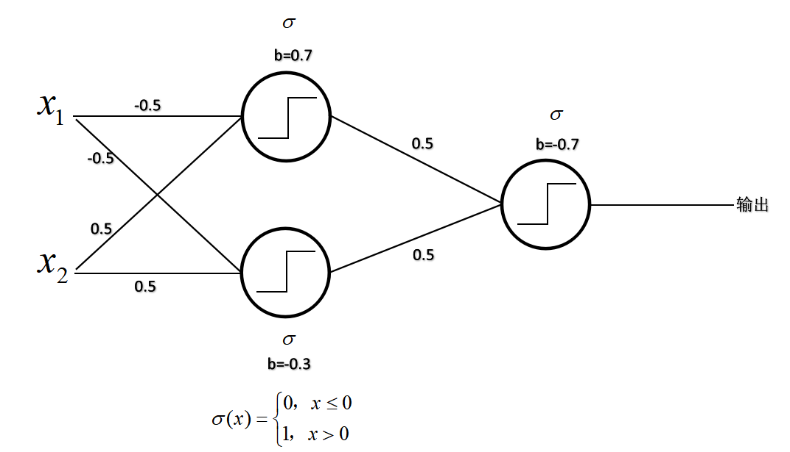

8.1 
$$
\sigma(x_1w_1+x_2w_2+x_3w_3+b)=\sigma(1)=\frac{1}{1+e^{-1}}
$$
8.2
$$
\left [
\begin{matrix}
w_{11}^{(1)} & w_{12}^{(1)} \\
w_{21}^{(1)} & w_{22}^{(1)} \\
\end{matrix}
\right ]
\left [
\begin{matrix}
x_1 \\
x_2
\end{matrix}
\right ]
+
\left [
\begin{matrix}
b_1^{(1)} \\
b_2^{(1)}
\end{matrix}
\right ] 
=
\left [
\begin{matrix}
-3 \\
4
\end{matrix}
\right ] \\
relu\left [\begin{matrix} -3 \\4 \end{matrix} \right ] = \left [\begin{matrix} 0 \\4 \end{matrix} \right ]\\
identity(w_{11}^{(2)} *0 + w_{12}^{(2)} * 4 + b_1) = -5
$$


8.3

 

8.4

LinearRegression


LogisticRegression


SoftmaxRegression


8.5

设隐藏层的输出为$h_1,h_2$

由习题8.2可得，$v=-5,h_1=0,h_2=4$
$$
L(v)=(v-y)^2\\
v = w_{11}^{(2)}h_1+w_{12}^{(2)}h_2+b_1^{(2)}\\
h_1=relu(w_{11}^{(1)}x_1+w_{12}^{(1)}x_2+b_1^{(1)})\\
h_2=relu(w_{21}^{(1)}x_1+w_{22}^{(1)}x_2+b_2^{(1)})\\
\frac{\partial L}{\partial b_{1}^{(2)}}=\frac{\partial L}{\partial v}\frac{\partial v}{\partial b_{1}^{(2)}}= 2(v-y)=2   \\
\frac{\partial L}{\partial w_{11}^{(2)}}=\frac{\partial L}{\partial v}\frac{\partial v}{\partial w_{11}^{(2)}}= 2(v-y) h_1=-6 \\
\frac{\partial L}{\partial w_{12}^{(2)}}=\frac{\partial L}{\partial v}\frac{\partial v}{\partial w_{12}^{(2)}}= 2(v-y) h_2=8\\
由于h_1=0\\
则
\frac{\partial L}{\partial b_{1}^{(1)}}=\frac{\partial L}{\partial v}\frac{\partial v}{\partial h_1}\frac{\partial h_1}{\partial b_1^{(1)}}=0\\
\frac{\partial L}{\partial w_{11}^{(1)}}=\frac{\partial L}{\partial v}\frac{\partial v}{\partial h_1}\frac{\partial h_1}{\partial w_{11}^{(1)}}=0\\
\frac{\partial L}{\partial w_{12}^{(1)}}=\frac{\partial L}{\partial v}\frac{\partial v}{\partial h_1}\frac{\partial h_1}{\partial w_{12}^{(1)}}=0\\
\frac{\partial L}{\partial b_{2}^{(1)}}=\frac{\partial L}{\partial v}\frac{\partial v}{\partial h_2}\frac{\partial h_2}{\partial b_2^{(1)}}
=2(v-y)w_{12}^{(2)}=-2\\
\frac{\partial L}{\partial w_{21}^{(1)}}=\frac{\partial L}{\partial v}\frac{\partial v}{\partial h_2}\frac{\partial h_2}{\partial w_{21}^{(1)}}=2(v-y)w_{12}^{(2)}x_1=2\\
\frac{\partial L}{\partial w_{22}^{(1)}}=\frac{\partial L}{\partial v}\frac{\partial v}{\partial h_2}\frac{\partial h_2}{\partial w_{22}^{(1)}}=2(v-y)w_{12}^{(2)}x_2=-4\\
$$
8.6

令
$$
S=softmax(v)\\
S_i=\frac{e^{v_i}}{\sum_j^k e^{v_j}}\\
\frac{\partial S_i}{\partial v_j}=\frac{\frac{\partial e^{v_i}}{\partial v_j}\sum_j^k e^{v_j}-e^{v_j}\frac{\sum_j^k e^{v_j}}{\partial v_j}}{(\sum_j^k e^{v_j})^2}\\
i=j时，\frac{\partial S_i}{\partial v_j}=\frac{e^{v_i}\sum_j^k e^{v_j}-e^{v_i}e^{v_i}}{(\sum_j^k e^{v_j})^2}=S_i-S_i^2\\
i≠j时，\frac{\partial S_i}{\partial v_j}=\frac{0-e^{v_i}e^{v_j}}{(\sum_j^k e^{v_j})^2}=-S_iS_j\\
L=-\sum_{i=1}^k y_i\log S_i\\
\frac{\partial L}{\partial S_i}=-\frac{y_i}{S_i}\\
\begin{align}
\frac{\partial L}{\partial v_i} &= \sum\frac{\partial L}{\partial S_j}\frac{\partial S_j}{\partial v_i}\\
&=\frac{\partial L}{\partial S_i}\frac{\partial S_i}{\partial v_i}+\sum_{i≠j}\frac{\partial L}{\partial S_j}\frac{\partial S_j}{\partial v_i}\\
&=-\frac{y_i}{S_i}(S_i-S_i^2)+\sum_{i≠j}\frac{y_j}{S_j}S_iS_j\\
&=-y_i+y_iS_i+\sum_{i≠j}y_jS_i\\
&=-y_i+S_i(y_i+\sum_{i≠j}y_j)\\
&=S_i-y_i\\
\end{align}
\\
所以\frac{\partial L}{\partial v} = softmax(v) - y
$$
8.7

由习题8.6可得$$\frac{\partial L}{\partial v} = softmax(v) - y$$

则，
$$
\frac{\partial L}{\partial b_i} = \frac{\partial L}{\partial v_i}\frac{\partial v_i}{\partial b_i}=(softmax(v_i)-y)\sigma'(\sum_{t=1}^nw_{it}x_t+b_i) \quad i=1,2\\
\frac{\partial L}{\partial w_{it}}=\frac{\partial L}{\partial v_i}\frac{\partial v_i}{\partial w_{it}}=(softmax(v_i)-y)\sigma'(\sum_{t=1}^nw_{it}x_t+b_i)x_t \quad i=1,2  \quad t=1,2,...,n\\
$$
8.8

神经网络由于多个隐藏层的存在，导致最终的目标函数不一定是凸函数，例如输出=$w_1w_2x$，第一层参数为$w_1$，第二层参数为$w_2$，两层都使用identity激活函数，目标函数使用均方误差，则目标函数为
$$
\min_{w_1,w_2}\|w_1w_2x-y\|^2
$$
显然这不是一个凸函数

8.9

```python
import numpy as np

def get_accuracy(y, z):
    I = (y == z).astype(np.int)
    return np.average(I)

def softmax(v):
    e = np.exp(v)
    s = e.sum(axis=0)
    for i in range(len(s)):
        e[i] /= s[i]
    return e

class IdentityActivator:
    def value(self, s):
        return s
    
    def derivative(self, s):
        return 1

class SigmoidActivator:
    def value(self, x):
        return 1.0 / (1.0 + np.exp(-x))
    
    def derivative(self, x):
        y = self.value(x)
        return y * (1 - y)
    
class ReLUActivator:
    def value(self, s):
        return np.maximum(0, s)
    
    def derivative(self, s):
        return (s > 0).astype(np.int)
    
class SoftmaxCrossEntropy:
    def value(self, y, v):
        p = softmax(v)
        return - (y * np.log(p)).sum()
    
    def derivative(self, y, v):
        p = softmax(v)
        return p - y
    
class MSE:
    def value(self, y, v):
        return (v - y) ** 2
    
    def derivative(self, y, v):
        return 2 * (v - y)

class Layer:
    def __init__(self, n_input, n_output, activator = IdentityActivator()):
        self.activator = activator
        r = np.sqrt(6.0 / (n_input + n_output))
        self.W = np.random.uniform(-r, r, (n_output, n_input))
        self.b = np.zeros((n_output, 1))
        self.outputs = np.zeros((n_output, 1))
        
    def forward(self, inputs):
        self.inputs = inputs
        self.sums = self.W.dot(inputs) + self.b
        self.outputs = self.activator.value(self.sums)
    
    def back_propagation(self, delta_in, learning_rate):
        d = self.activator.derivative(self.sums) * delta_in
        self.delta_out = self.W.T.dot(d)
        self.W -= learning_rate * d.dot(self.inputs.T)
        self.b -= learning_rate * d
    
class NeuralNetwork:
    def __init__(self, layers, loss):
        self.layers = layers
        self.loss = loss
        
    def forward(self, x):
        layers = self.layers
        inputs = x
        for layer in layers:
            layer.forward(inputs)
            inputs = layer.outputs
        return inputs
    
    def back_propagation(self, y, outputs, learning_rate):
        delta_in = self.loss.derivative(y, outputs)
        for layer in self.layers[::-1]:
            layer.back_propagation(delta_in, learning_rate)
            delta_in = layer.delta_out
            
    def fit(self, X, y, N, learning_rate, p): # p是dropout的概率
        for t in range(N):
            i = np.random.randint(0, len(X))
            j = np.random.permutation(len(X[i]))[:int(len(X[i])*p)] # 随机取p的神经元，0≤p≤1
            outputs = self.forward(X[i][j].reshape(-1,1))             
            self.back_propagation(y[i].reshape(-1,1), outputs, learning_rate)
        self.layers.W = self.layers.W * p # 调整每条边的权重
              
    def predict(self, X):
        y = []
        for i in range(len(X)):
            p = self.forward(X[i].reshape(-1,1)).reshape(-1)
            y.append(p)
        return np.array(y)    
```


8.10

```python
import tensorflow as tf
from tensorflow import keras
import numpy as np
fashion_mnist = keras.datasets.fashion_mnist
(train_images, train_labels), (test_images, test_labels) = fashion_mnist.load_data()
train_images, test_images = train_images / 255.0, test_images / 255.0
model = keras.Sequential([
    keras.layers.Flatten(input_shape=(28, 28)),
    keras.layers.Dense(128, activation='relu'),
    keras.layers.Dense(10)
])
model.compile(optimizer='adam',
              loss=tf.keras.losses.SparseCategoricalCrossentropy(from_logits=True),
              metrics=['accuracy'])
model.fit(train_images, train_labels, epochs=10)
test_loss, test_acc = model.evaluate(test_images,  test_labels, verbose=2)

print('\nTest accuracy:', test_acc)
```

